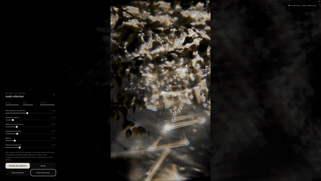
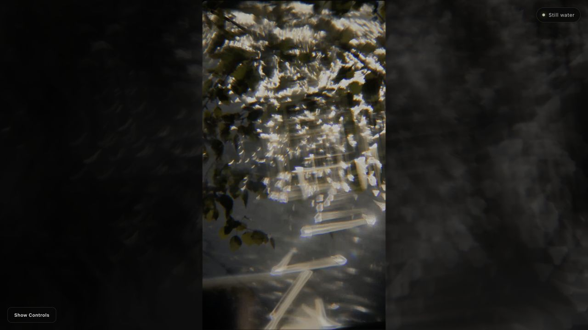

# Water, Listening

An audio-reactive water-reflection artwork built from a frame of the source video. Music moves the water surface first; reflected light follows the changing water normals, while foreground leaves respond with a softer delay. When the input becomes silent, the entire scene settles into a completely still frame.

## Video demo

<a href="https://melloww-w.github.io/audio-reactive-water-reflection/video-demo.html">
  
</a>

<p align="center">
  <a href="https://melloww-w.github.io/audio-reactive-water-reflection/video-demo.html"><strong>Play the 45-second demo with sound and video controls →</strong></a>
</p>

The preview above plays automatically without sound. Open the full 1080p recording to hear the music and see how microphone sensitivity, water distortion, shimmer, bloom, and optical dispersion change the response. A [direct MP4 download](./demo-output/water-reflection-ripple-clean-audio-45s-ready.mp4) is also available.

## Interactive demo

<a href="https://melloww-w.github.io/audio-reactive-water-reflection/">
  
</a>

<p align="center">
  <a href="https://melloww-w.github.io/audio-reactive-water-reflection/"><strong>Launch the interactive artwork →</strong></a>
</p>

The public demo is hosted with GitHub Pages over HTTPS, which allows the browser to request microphone access. Select **Enable Microphone**, play music near the device, and then pause the music to watch the water return to stillness. Audio analysis remains on your device.

## Interaction model

```text
Microphone input
      ↓
Web Audio frequency analysis
      ↓
Bass / mids / highs / volume
      ↓
Water displacement and flow
      ↓
Refraction, shimmer, bloom, and rainbow dispersion
      ↓
Delayed foreground-leaf response
```

The water responds in sync with the music. Reflected light is a consequence of the changing surface rather than an independent animation, and the leaves follow with a gentler, slightly delayed motion.

## Technology stack

### Artwork runtime

| Layer | Technology | Role |
| --- | --- | --- |
| Structure | HTML5 | Accessible controls and fullscreen artwork container |
| Presentation | CSS3 | Responsive layout, control panel, and fullscreen composition |
| Interaction | Vanilla JavaScript | Audio analysis, smoothing, animation state, and UI behavior |
| Creative coding | p5.js 2.3.1 | WebGL canvas, lifecycle, and shader integration |
| GPU rendering | WebGL | Real-time, hardware-accelerated image processing |
| Visual simulation | GLSL vertex and fragment shaders | Water displacement, refraction, flowing highlights, bloom, and optical dispersion |
| Audio analysis | Web Audio API | Volume and bass, mid, and high-frequency extraction |
| Audio input | WebRTC `getUserMedia()` | Browser microphone permission and live audio stream |
| Source material | PNG and JPEG | Water-reflection frame and supporting image textures |

### Build and hosting

| Layer | Technology | Role |
| --- | --- | --- |
| Development | Node.js, npm, Vite 8, and Vinext | Local development and deployable build generation |
| Hosting wrapper | React 19 | Lightweight deployment entry point; the artwork itself remains vanilla JavaScript |
| Continuous deployment | GitHub Actions | Publishes every update from `main` automatically |
| Public hosting | GitHub Pages | HTTPS hosting for microphone permission and the video player |

MediaPipe, webcam input, and hand tracking are not used in this audio-focused version.

## Run locally

Microphone access requires a secure browser context such as `localhost` or HTTPS.

```bash
npm install
npm run dev
```

Open [http://localhost:3000](http://localhost:3000) and select **Enable Microphone**.

For the dependency-free static version, you can instead run:

```bash
python3 -m http.server 8000
```

Then open [http://localhost:8000](http://localhost:8000).

## Controls

- **Microphone sensitivity** adjusts the input response.
- **Ambient motion** sets the underlying flow while sound is present.
- **Reflection distortion** changes the strength of the water refraction.
- **Highlight shimmer** controls the moving reflected-light details.
- **Bloom** adjusts the softness around bright reflections.
- **Optical dispersion** controls the subtle rainbow separation in sunlight.

## Privacy

Audio is analyzed locally in the browser. It is not recorded or uploaded.
